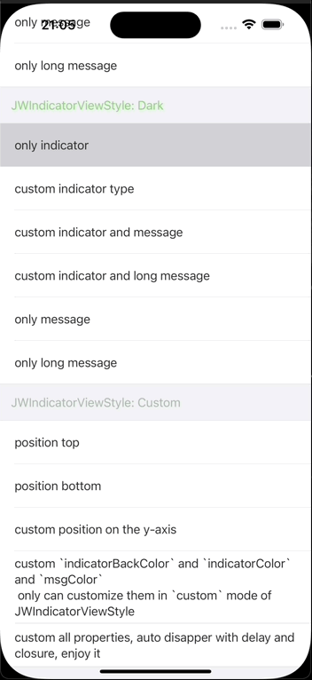
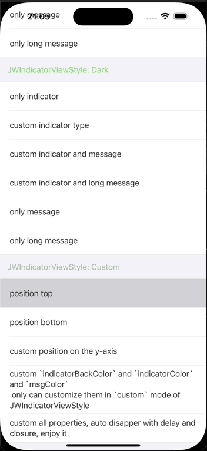

# Example

<div align="center">
    
    
    
</div>

# JWIndicatorView

[](https://travis-ci.org/Sfh03031/JWIndicatorView)
[](https://cocoapods.org/pods/JWIndicatorView)
[](https://cocoapods.org/pods/JWIndicatorView)
[](https://cocoapods.org/pods/JWIndicatorView)

## Introduction

JWIndicatorView is a subclass of UIView used to implement the loading indicator effect. At present, it supports 33 different indicator styles and flexible customization, uses chain syntax encapsulation, which makes it easy to read and write.

(JWIndicatorView是一个UIView的子类，用以实现加载指示器效果。目前它支持33种不同的指示器样式，并支持灵活的自定义，使用链式语法封装，读写简便。)

To run the example project, clone the repo, and run `pod install` from the Example directory first.

## Requirements

* iOS 12.0 or later
* Swift 5.9.2
* Xcode 15.1

## Installation

JWIndicatorView is available through [CocoaPods](https://cocoapods.org). To install
it, simply add the following line to your Podfile:

```ruby
pod 'JWIndicatorView'
```

If you want to use the latest features of JWIndicatorView use normal external source dependencies.

```ruby
pod 'JWIndicatorView', :git => 'https://github.com/Sfh03031/JWIndicatorView.git'
```

## Usage

First, install and import JWIndicatorView
```swift

import JWIndicatorView

```

Second, use class methods of JWIndicatorView where you needed to show or hide

```swift

# show
JWIndicatorView.show()

# hide
JWIndicatorView.hide()

```
It's that simple, enjoy it.

JWIndicatorView provides 3 different styles in the form of enumeration, default is `dark`, Like this:

```swift

/// JWIndicatorViewStyle
public enum JWIndicatorViewStyle: CaseIterable {
    case light
    case dark
    case custom
}

```
it alse provides 3 different positions in the form of enumeration, default is `center`, Like this:

```swift

/// UIIndicatorPositionStyle
public enum UIIndicatorPositionStyle: CaseIterable {
    case top
    case center
    case bottom
}

```

when the style of JWIndicatorViewStyle is `custom`, you can customize all properties in `JWIndicatorViewConfig` category, Like:

```swift

    /// JWIndicatorViewStyle of JWIndicatorView, default = `dark`
    public var style: JWIndicatorViewStyle = .dark
    /// background color of JWIndicatorView, default = `clear`
    @IBInspectable public var maskColor: UIColor = UIColor(white: 0, alpha: 0.4)
    /// whether tap JWIndicatorView to dismiss or not, default = `false`
    @IBInspectable public var isTapDismiss: Bool = false
    
    ...

```

 You can try to customize the effect you want with different combinations，`JWIndicatorViewConfig` alse offers instance setting methods to all properties for easy customization, like this:
 
 ```swift
 
     //TODO: JWIndicatorView
    
    /// type of JWIndicatorViewStyle
    func style(_ value: JWIndicatorViewStyle = .light) -> Self {
        self.style = value
        return self
    }
    
    /// background color of JWIndicatorView
    func maskColor(_ value: UIColor = UIColor(white: 0, alpha: 0.4)) -> Self {
        self.maskColor = value
        return self
    }
    
    /// whether tap JWIndicatorView to dismiss or not
    func tapDismiss(_ value: Bool = false) -> Self {
        self.isTapDismiss = value
        return self
    }
    
    ...
 
 ```
 
JWIndicatorView provides two category methods to display, the first one is to show a simple IndicatorView:

```
    /// Show `JWIndicatorView` in keyWindow
    /// - Parameters:
    ///   - type: type of indicator, default = `circleStrokeSpin`
    ///   - style: style of indicator, default = `dark`
    ///   - position: position of indicator, default = `center`
    ///   - message: info of indicator text, default = nil
    static func show(_ type: NVActivityIndicatorType? = nil, style: JWIndicatorViewStyle? = nil, position: UIIndicatorPositionStyle? = nil, message: String? = nil) {
        if let contain = UIApplication.shared.windows.first(where: { $0.isKeyWindow }) {
            if let exist = contain.subviews.first(where: { $0 is JWIndicatorView }) {
                exist.removeFromSuperview()
            }
            let config = JWIndicatorViewConfig()
            config.type = type
            config.style = style ?? .dark
            config.position = position ?? .center
            config.message = message
            JWIndicatorView().show(in: contain, config: config)
        }
    }

```

the other one is to show a custom IndicatorView:

```swift

    /// Show custom `JWIndicatorView` in keyWindow
    /// - Parameters:
    ///   - config: `JWIndicatorViewConfig`, which is a properties collection
    ///   - delay: time if auto disapper after show, default = `0`
    ///   - complete: closure after `JWIndicatorView` disapper, default = nil
    static func show(config: JWIndicatorViewConfig, delay: TimeInterval = 0, complete:(()->())? = nil) {
        if let contain = UIApplication.shared.windows.first(where: { $0.isKeyWindow }) {
            if let exist = contain.subviews.first(where: { $0 is JWIndicatorView }) {
                exist.removeFromSuperview()
            }
            JWIndicatorView().show(in: contain, config: config)
            if delay > 0 {
                DispatchQueue.main.asyncAfter(deadline: DispatchTime.now() + delay) {
                    JWIndicatorView().hide(in: contain, complete: complete)
                }
            }
        }
    }

```

## Change log

2025.04.11, 0.1.0
- Initial version(zh: 初始版本)

## Author

Sfh03031, sfh894645252@163.com

## License

JWIndicatorView is available under the MIT license. See the LICENSE file for more info.
